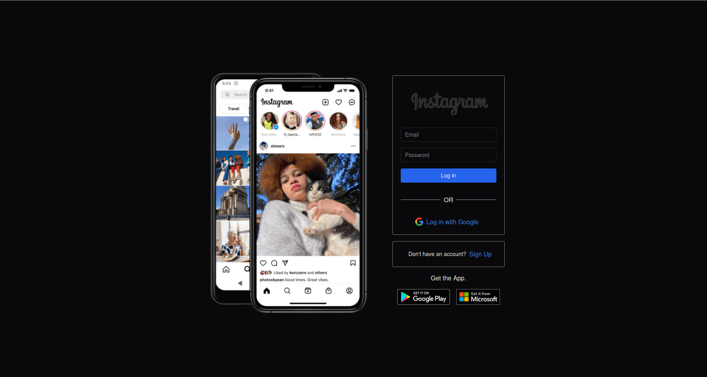
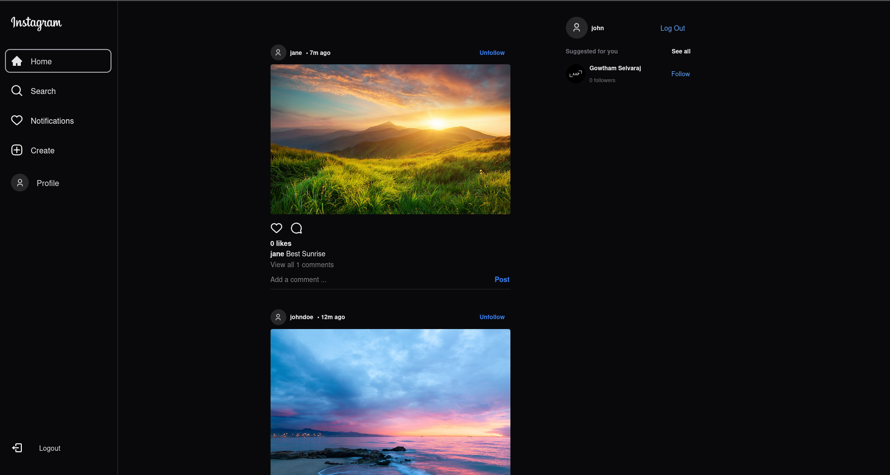
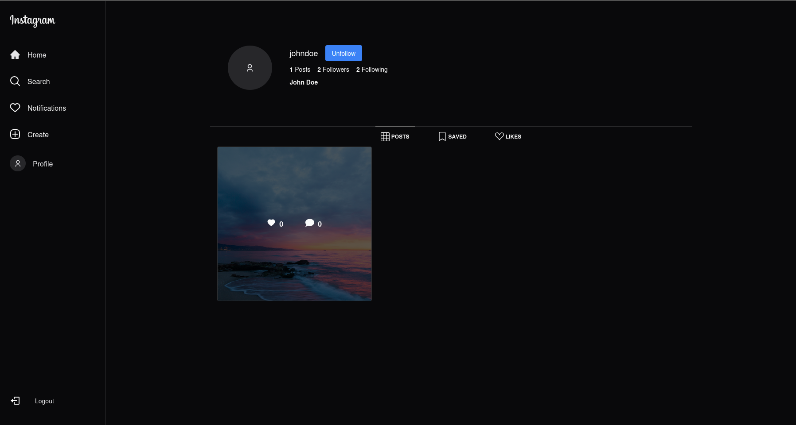

# Instagram Clone

A full-stack **Instagram Clone** built using **React**, **Chakra UI**, **Firebase**, **React Router DOM**, **React Icons**, and **Zustand** for state management.  
This project demonstrates how to build a responsive, real-time social media application with authentication, post management, and cloud storage.

---

## Why React + Firebase

- **Fast Development:** Firebase handles authentication, database, and storage with minimal setup.  
- **Component-Driven:** React with Chakra UI makes UI building modular and responsive.  
- **Scalable:** Firebase services ensure real-time updates and easy scaling.  
- **Lightweight State Management:** Zustand provides a simple and predictable state store.  
- **Single Page App:** Managed by React Router DOM for smooth navigation.

---

## Technologies Used

| Technology | Purpose |
|-------------|----------|
| **React** | Front-end library for building UI components |
| **Chakra UI** | Modern component library for styling |
| **Firebase** | Authentication, Firestore, and Storage |
| **React Router DOM** | Client-side routing |
| **React Icons** | Icon pack for UI elements |
| **Zustand** | Lightweight global state management |

---

## Installation & Setup

### 1. Clone the Repository
```
git clone https://github.com/gowthamselvaraj327/insta-clone.git
cd insta-clone
```
### 2. Install Dependencies
```
npm install
```
### 3. Create a Firebase Project
1. Visit [Firebase Console](https://console.firebase.google.com/)
2. Create a new project and enable:
   - **Authentication** (Email/Password and Google)
   - **Firestore Database**
   - **Storage**
3. Copy your project config.
4. Rename **.env.template** to **.env.local** and add your Firebase config.


### 4. Run the Application
```
npm run dev
```
Then open http://localhost:5173 in your browser.

## Features

- User Authentication (Sign Up / Login / Logout)
- Create, Like, and Comment on Posts
- User Profile Pages with Follow/Unfollow
- Image Upload using Firebase Storage
- Responsive UI with Dark Mode

- Real-time updates powered by Firestore

## Project Structure
```
insta-clone/
├── public/
├── src/
│   ├── assets/
│   ├── components/
│   ├── firebase/ 
│   ├── hooks/    
│   ├── Layout/
│   ├── pages/  
|   ├── store/  
|   ├── utils/
│   ├── App.jsx
│   └── main.jsx
├── .env.local
├── package.json
└── README.md
```
## Screenshots

- ### Login Page
    
- ### Feed Page
    
- ### Profile Page
    

## Deployment (Vercel)
This application is deployed using Vercel for fast, scalable, and serverless hosting.

### Steps:
1. Push your code to GitHub.
2. Go to [Vercel](https://vercel.com/)
    - Login or Signup with your github account
3. Import your repository.
4. Add the same Firebase environment variables in the Environment Variables.
5. Deploy — Vercel automatically builds and hosts your app.


- **Live Demo:** [insta-clone](https://social-app-clone-rust.vercel.app/)
